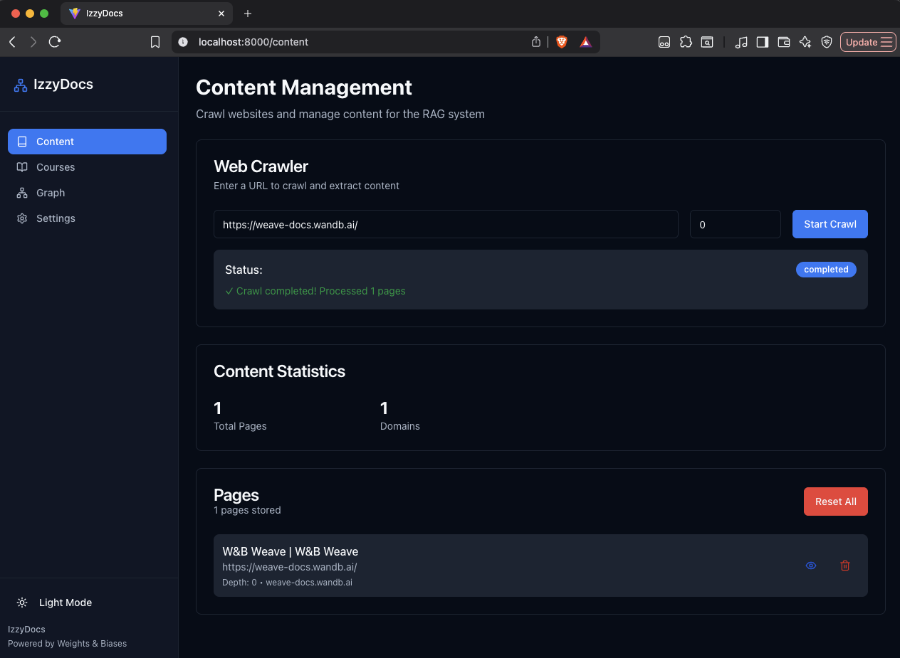
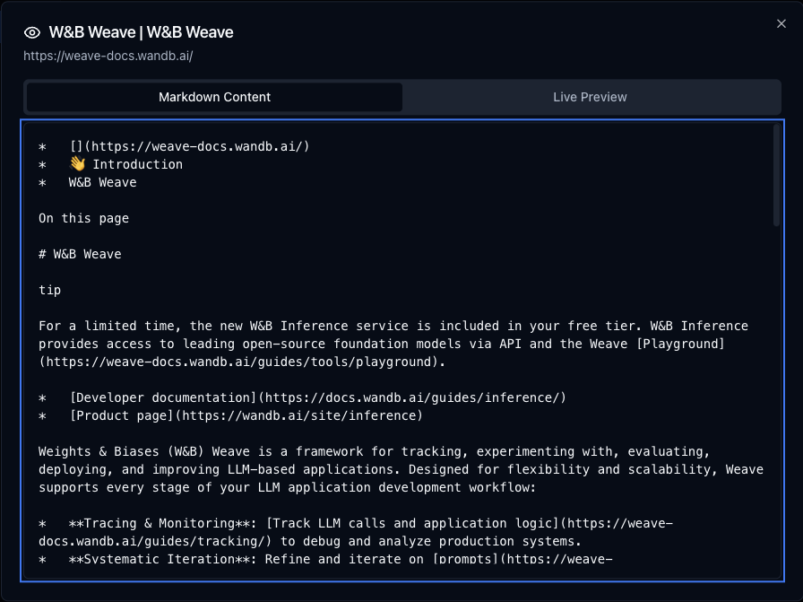
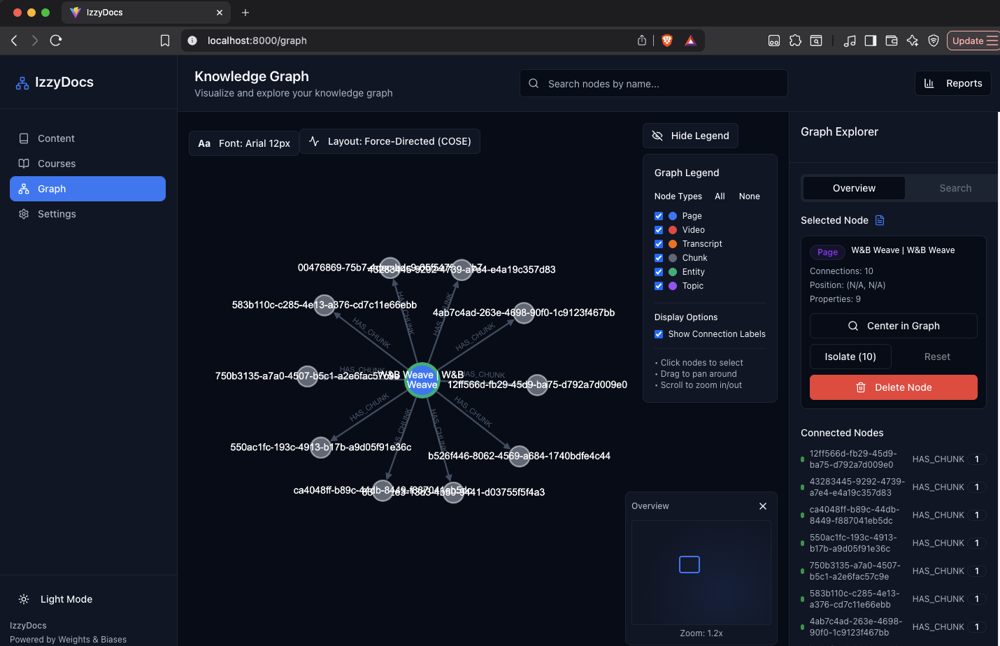
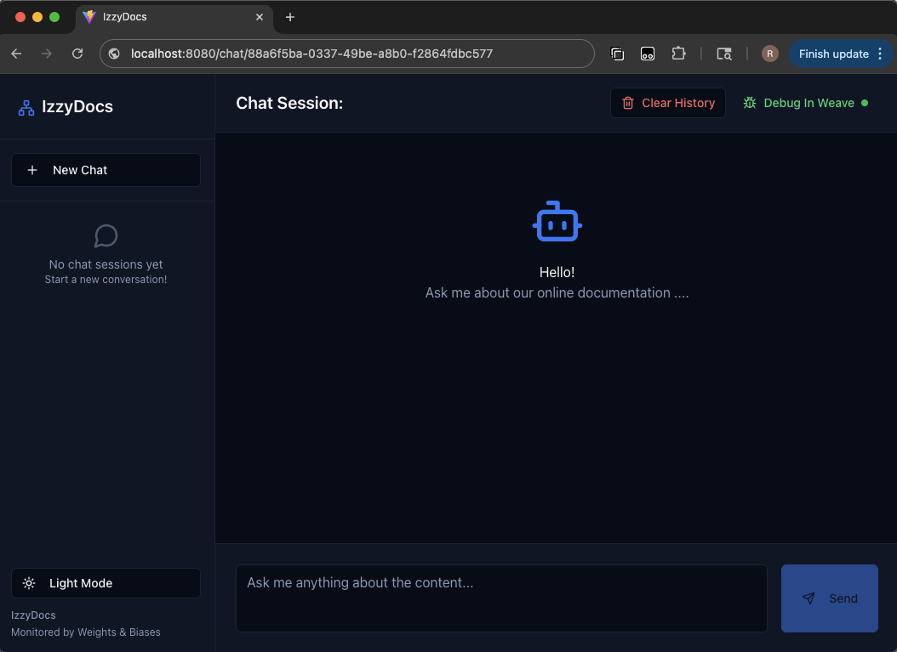
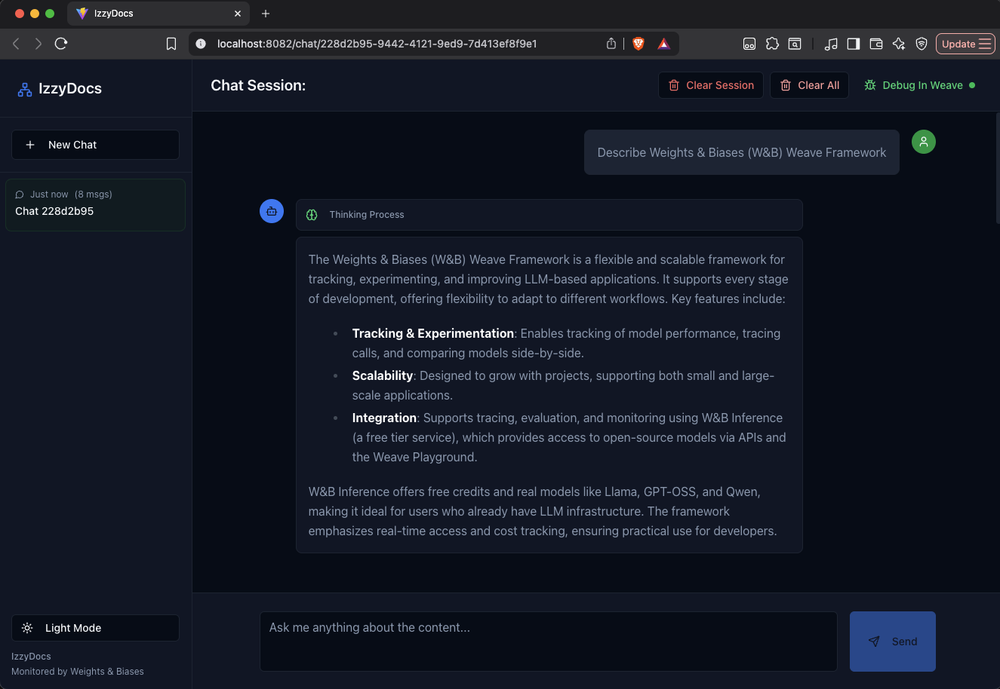
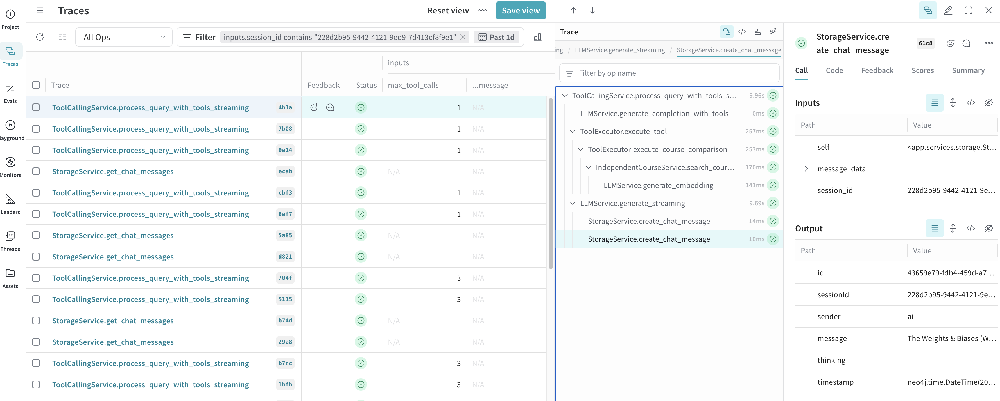
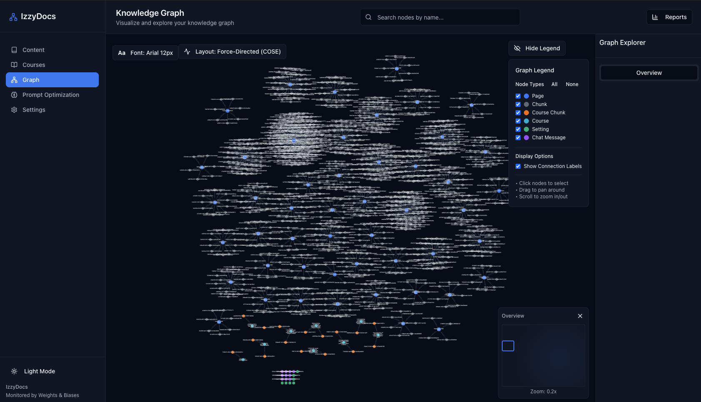

# IzzyDoc - Your intelligent documentation copilot 
## 🎯 Executive Summary
**Problem Statement:**
1. Users do not read documentation only snippets to try to solve their immediate needs. Product documentation are written by technical folks which leads to content that is not well organized and barely understandable. It is also written with a deep context of the product that new users do not have. Most of the times the knowledge the user is seeking is buried in a blog post or video or some other asset that is not part of the documentation. All these challenges lead to new users stuggling to adopt new products that require deep technical expertise. 
2. LLM solutions today are mostly centered around text responses for specific queries. However, we need to extend these responses to guide users through an adoption journey of their own and give them bread crumbs to take the next step in their journey.

**Solution:**
IzzyDoc is an intelligent documentation copilot that uses Graph RAG and agentic AI to provide contextually-aware answers to user queries. It learns from the documentation structure and relationships to provide precise answers while pointing users to additional resources for further exploration.

**Business Value:**
This intelligent documentation copilot transforms how users learn and interact with product documentation. By combining Graph RAG with agentic AI, it provides contextually-aware answers, reduces time-to-productivity for new users, and scales support operations without increasing headcount. It is a game-changer for product documentation and for helping onboard new users.

**Technical Innovation:**
Built as a dual-backend microservices architecture, this project demonstrates enterprise-grade AI engineering patterns:
- **Private LLM Models** - Use of Private LLM models for inference
- **Graph RAG** - Knowledge graphs enhance retrieval accuracy beyond traditional vector search
- **Agentic AI** - Autonomous reasoning and multi-step query decomposition
- **Multi-language Observability** - Unified Weave instrumentation across Node.js and Python services
- **Production Patterns** - Streaming responses, hallucination detection, comprehensive evaluation framework
- **Prompt Engineering** - Provides a framework for Reinforncement Learning to generate optimized prompts given context and samples of expected responses.

This project serves as both a functional product and a technical showcase for modern RAG architecture, MLOps best practices, and production-grade AI observability. Feel free to use this as a template for your own llm projects, it is much more than just a boilerplate project, it is a production ready solution ready for your customization for your use case. It inclues an extensive test suite that gives you a great foundation to build on with confidence. It includes Unit, Funcational, Integration and UI tests. 


[](https://wandb.ai/weave)
[](https://nodejs.org/)
[](https://www.python.org/)
[](https://neo4j.com/)
[](https://reactjs.org/)
[](https://ollama.ai/)

**Note:** This project runs entirely locally using Ollama for LLM inference - no external API calls required for the core functionality.
---

## 🎯 Project Overview
- **Neo4j** - Database for storing content metadata and embeddings
- **Ollama** - Local LLM inference for response generation. It by default uses the Qwen3:0.6b model and nomic-embed-text:latest for embeddings. You need to install these.
- **Admin (Node.js + Reaact + Neo4j)** - Admin Portal for Web crawling and content ingestion
- **Agent (Python + FastAPI + React)** - Client UI for chat inteface, RAG pipeline and LLM interactions
- **Weave Instrumentation** - Complete observability across all services

### Why This Architecture?

1. **Language Strengths** - Node.js for I/O-bound crawling, Python for ML/AI operations
2. **Separation of Concerns** - Clear boundaries between ingestion and inference
3. **Independent Scaling** - Scale crawler and chat services independently
4. **Weave Demonstration** - Shows multi-language observability. Experiment with Node.js instrumentation and develop features not supported by Weave's Node.js SDK. 
5. **Production Patterns** - Real-world microservices architecture

---

## 📁 Project Structure

```
project/
├── admin/                  # Node.js + TypeScript (Content Ingestion)
│   ├── client/             # React frontend for admin UI
│   ├── src/
│   │   ├── services/       # Web crawler, storage
│   │   ├── weave/          # Weave instrumentation
│   │   ├── routes/         # API routes
│   │   └── index.ts        # Express server
│   ├── tests/              # Unit, Functional, Integration and UI Tests
│   ├── package.json        # Node.js dependencies and scripts
│   └──  tsconfig.json      # TypeScript config
│
├── agent/                   # Python + FastAPI (RAG Chat)
│   ├── app/
│   │   ├── services/       # RAG, LLM, retrieval
│   │   ├── weave/          # Weave instrumentation
│   │   ├── tools/          # Agentic tools
│   │   ├── routes/         # Chat endpoints
│   │   └── main.py         # FastAPI server
│   ├── client/             # React front end for chat UI
│   ├── tests/              # Unit, Functional, Integration and UI Tests
│   ├── requirements.txt    # Python dependencies
│   └── pyproject.toml      # Python project config
│
├── evaluations/            # Evaluation Tests
│
├── shared/                 # Shared types and schemas
│   └── schema.ts
│
├── scripts/                # Utility scripts
│   ├── check.sh            # Check prerequisites
│   ├── health.sh           # Check service health
│   ├── clean.sh            # Clean build artifacts
│   └── lint.sh             # Run linters
│
├── package.json            # Root package.json commands >npm run <command>
│   ├── preinstall          # Check prerequisites
│   ├── install:all         # Run install scripts for all admin and agent
│   ├── build               # Build Admin and Agent
│   ├── build:admin         # Build admin project only
│   ├── build:agent         # Build agent project only
│   ├── dev:admin           # Start admin project only
│   ├── dev:agent           # Start agent backend only
│   ├── test                # Run admin and agent tests
│   ├── test:admin          # Run admin tests only
│   └── test:agent          # Run agent tests only
└── README.md               # This file
```

---

## 🏗️ Architecture

**Admin  (Node.js + React)** - Port : Environment Variable :ADMIN_PORT
- Both backend and frontend served at this port
- Web crawling and content ingestion
- Markdown extraction and storage
- Knowledge graph building in Neo4j
- Weave instrumentation 
    - **Fine-grained control** - Manual span creation and management for complex workflows
    - **Custom attributes** - Add detailed metadata and context to traces
    - **Nested operations** - Explicit parent-child span relationships for multi-step processes
    - **Performance optimization** - Control when spans start/end to minimize overhead
    - **Legacy compatibility** - Works with older Node.js versions and frameworks

**Agent (Python + FastAPI + React)** - 
- Backend: AGENT_BACKEND_PORT
- Frontend: AGENT_FRONTEND_PORT - Used to access the chat UI
- RAG pipeline implementation
- LLM integration - primarily using Ollama for local inference
- Vector search and retrieval from Neo4j
- Response generation with streaming
- Hallucination detection
- Weave evaluations and monitoring (Python SDK: `weave`)

### Data Flow

```
1. Content Ingestion:
   User → Admin UI → Admin Backend → [Neo4j + Local Files]

2. RAG Query:
   User → Chat UI → Agent Backend → Neo4j (read) → LLM → Toosl → Response
```

### Key Design Decisions
- **Neo4j** - Allows for Graph RAG, relating content and embeddings
- **No direct backend-to-backend communication** - Backends communicate through shared Neo4j database
- **Admin Backend writes, Agent Backend reads** - Clear separation of concerns
- **Hybrid storage** - Markdown in local files, metadata/embeddings in Neo4j
- **Unified Weave project** - Both backends log to same Weave project for unified observability
- **Ollama for local LLM inference** - No external API calls required for the core functionality. Allows for faster experimentation and cost savings. 
- **Qwen3:0.6b Model** - This model allows for very fast local inference and is a thinking model. You can try out other models supported by Ollama.
---

## 🚀 Quick Start

### Prerequisites

- **Node.js 18+** - For admin backend and frontend
- **Python 3.11.7** - For agent backend
- **Neo4j Database** - Graph database (running on port 7687)
- **Ollama** - For local LLM (running on port 11434)
- **W&B Account** - Sign up at https://wandb.ai/site

### ⚡ Super Quick Start - after you have installed node, python, neo4j and ollama

**Recommended: Using npm scripts** : after these steps you need to setup your .env.local file
```bash
cd project

# Check prerequisites
npm run preinstall

# Install dependencies
npm run install:all

# Build all services
npm run build

# Start admin in one terminal
npm run dev:admin

# Start agent in another terminal
npm run dev:agent

```

### Individual Project steps if needed

```bash
# From project root
cd project

# Install admin and admin/clientdependencies
cd admin
npm install
npm run build
cd client
npm install
npm run build
cd ..
cd ..

# Install agent and agent/client dependencies
cd agent
python -m venv venv
source venv/bin/activate  # On Windows: venv\Scripts\activate
pip install -r requirements.txt
npm run build
cd client
npm install
npm run build
cd ..
```


### Environment Configuration - before starting the applications

Copy .env.example to .env.local and edit to match your environment

```bash
# Agent Backend 
AGENT_CLIENT_PORT=3000
AGENT_BACKEND_PORT=3001

# Admin 
ADMIN_PORT=3000

# Content Storage (Local File System)
CONTENT_STORAGE_PATH=./storage/content

# Neo4j
NEO4J_URI=neo4j://localhost:7687
NEO4J_USER=neo4j
NEO4J_PASSWORD=your_password
NEO4J_DB_NAME=your_db_name

# Ollama (Local LLM)
OLLAMA_BASE_URL=http://localhost:11434
OLLAMA_MODEL=qwen3:0.6b
OLLAMA_EMBEDDING_MODEL=nomic-embed-text:latest

# Weave (Weights & Biases - Shared Project)
WANDB_PROJECT=<your_wandb_project_name>
WANDB_ENTITY=<your_wandb_entity_name>
WANDB_API_KEY=<your_wandb_key>
```

### Running the Application

**Step 1: Start Required Services**
```bash
# Start Neo4j (if not already running)
neo4j console
# Or if using Docker:
# docker run --name neo4j -p 7474:7474 -p 7687:7687 -e NEO4J_AUTH=neo4j/password -d neo4j:latest

# Start Ollama (if not already running)
ollama serve

# Pull required models if you have not done so already
ollama pull qwen3:0.6b
ollama pull nomic-embed-text:latest
```

**Step 2: Start Application Services**

You need **separate terminal windows**:

```bash
#From your root folder

# Terminal 1: Admin (Port ADMIN_PORT)
npm run dev:admin
navigate to http://localhost:ADMIN_PORT

# Terminal 2: Agent (Port AGENT_CLIENT_PORT)
npm run dev:agent
navigate to http://localhost:AGENT_CLIENT_PORT

# 1. Next is to add content to the system and then query it
# 2. Navigate to your weave project dashboard to view traces

```

---

## 📚 User Guide

### Getting Started After Installation

Once you have completed the installation and started all services, follow these steps to get IzzyDoc up and running:

#### Step 1: Ingest Documentation Content

1. **Open the Admin Console**
   - Navigate to `http://localhost:<ADMIN_PORT>` (default: 8181)
   - You should see the Admin UI with crawling options

2. **Start Your First Crawl**
   - Enter a documentation URL (e.g., `https://weave-docs.wandb.ai/`)
   - Set the crawl depth to `0` for a quick test (this will only import the single webpage)
   - Click "Start Crawl"
   - Monitor the progress in the Admin UI
   - Wait for the crawl to complete and content to be processed
   
   

3. **Verify Content Ingestion**
   - You can now click on the view icon of the page that shows you the markdown that was extracted from the page
   - 
   - You can navigate to the graph  to view the nodes: Page and Embeddings that were generated from the crawl
   - 

#### Step 2: Test the Chat Interface

1. **Open the Chat UI**
   - Navigate to `http://localhost:<AGENT_CLIENT_PORT>` (default: 8080)
   - You should see the chat interface
   - 

2. **Ask Your First Question**
   - Try asking: "Describe Weights & Biases (W&B) Weave Framework" 
   - You should see a streaming response similar to:
   
   

3. **Verify the Response**
   - The response should reference content from the crawled page
   - Monitor the Weave dashboard for traces
   - 

#### Step 3: Expand Your Knowledge Base

Once the basic test is working:

1. **Crawl More Content**
   - Return to the Admin Console
   - Increase the crawl depth (e.g., `2` or `3`) to ingest more pages
   - Crawl additional documentation sites relevant to your use case and build up your graph knowledge base.
   - 

2. **Test Complex Queries**
   - Ask multi-part questions
   - Test the agent's ability to synthesize information across multiple documents
   - Experiment with different query types

3. **Monitor Performance**
   - Check the Weave dashboard for:
     - Query latency
     - Retrieval accuracy
     - Hallucination detection results

---

## 🔍 Weave Instrumentation

This project demonstrates comprehensive Weave instrumentation across both backends:

### Admin (JavaScript SDK)

```typescript
import * as weave from '@wandb/weave';

// Initialize Weave
const projectName = process.env.WANDB_ENTITY
  ? `${process.env.WANDB_ENTITY}/${process.env.WANDB_PROJECT}`
  : process.env.WANDB_PROJECT;
await weave.init(projectName);

// Trace operations
@weave.op()
async function crawlPage(url: string) {
  // Weave automatically traces this function
  const content = await fetchPage(url);
  return content;
}
```

**Traced Operations:**
- Web page fetching
- Content extraction
- Knowledge graph extraction
- Embedding generation
- Neo4j storage operations

### Agent (Python SDK)

```python
import weave
import os

# Initialize Weave
project_name = os.getenv("WANDB_PROJECT", "support-app")
entity = os.getenv("WANDB_ENTITY", "")
full_project = f"{entity}/{project_name}" if entity else project_name
weave.init(full_project)

# Trace operations
@weave.op()
async def process_query(query: str):
    # Weave automatically traces this function
    context = await retrieve_context(query)
    response = await generate_response(query, context)
    return response
```

**Traced Operations:**
- Query processing
- Vector search and retrieval
- LLM calls (completion, streaming, embeddings)
- Hallucination detection
- Response generation

**Evaluations:**
- Retrieval quality (Precision@K, Recall@K, MRR)
- Hallucination detection accuracy
- End-to-end RAG quality

**Monitors:**
- Performance (latency, throughput, error rate)
- Quality (hallucination rate, retrieval success)
- Cost (token usage, API costs)

---

## 🧪 Testing Strategy

Each subproject includes three levels of testing:

### Unit Tests
- **Purpose:** Test individual functions/classes
- **Mocking:** Mock ALL external dependencies
- **Speed:** Fast (milliseconds)
- **Coverage Goal:** 100%

**Example:**
```typescript
// Admin Backend
import { vi } from 'vitest';
vi.mock('axios');
test('fetchPage should return HTML', async () => {
  vi.mocked(axios.get).mockResolvedValue({ data: '<html>...</html>' });
  // Test logic
});
```

### Functional Tests
- **Purpose:** Test complete workflows
- **Mocking:** Mock external services only (APIs, databases, LLMs)
- **Speed:** Medium (seconds)
- **Coverage Goal:** All major flows

**Example:**
```python
# Agent Backend
@pytest.mark.asyncio
async def test_rag_pipeline(mock_llm, mock_neo4j):
    # Test complete RAG flow with mocked dependencies
    response = await rag_service.process_query("What is Weave?")
    assert response is not None
```

### Integration Tests
- **Purpose:** Test with live services
- **Mocking:** No mocking - use real APIs
- **Speed:** Slow (minutes)
- **Coverage:** All major integration use cases

**Example:**
```typescript
// Frontend
test('should crawl and display content', async () => {
  // Call real admin API
  const response = await fetch('http://localhost:3002/api/crawler/start', {
    method: 'POST',
    body: JSON.stringify({ url: 'https://example.com' })
  });
  expect(response.ok).toBe(true);
});
```

**Running Tests:**
```bash
# Admin 
npm run test:unit          # Fast unit tests
npm run test:functional    # Functional tests
npm run test:integration   # Integration tests
npm run test:ui            # UI tests
npm run test               # All tests with coverage

# Agent 
pytest tests/unit              # Fast unit tests
pytest tests/functional        # Functional tests
pytest tests/integration       # Integration tests
npm run test:ui                # UI tests
pytest --cov=app --cov-report=html  # Coverage report

```

---

## 🎯 Key Features

### Admin Backend (Node.js)
- ✅ Web crawling with configurable depth
- ✅ Content extraction (HTML → Markdown)
- ✅ Knowledge graph extraction via LLM
- ✅ Embedding generation and storage
- ✅ Weave tracing (JavaScript SDK)

### Agent Backend (Python)
- ✅ RAG pipeline (query → retrieval → generation)
- ✅ Vector search in Neo4j
- ✅ LLM integration (Ollama/OpenAI)
- ✅ Streaming responses
- ✅ Hallucination detection
- ✅ Weave tracing, evaluations, monitors (Python SDK)

### Frontend (React)
- ✅ Admin tab for content management
- ✅ Chat tab for RAG queries
- ✅ Real-time progress tracking
- ✅ Streaming response display


#### Troubleshooting

If you encounter issues:

- **No response from chat:** Verify that Ollama is running and the model is downloaded
- **Empty or irrelevant answers:** Check that content was successfully ingested in Neo4j
- **Slow responses:** Consider using a smaller model or adjusting the retrieval parameters
- **Errors in Weave traces:** Verify your WANDB_API_KEY is set correctly

For detailed troubleshooting, check the logs in each terminal window or refer to the [Troubleshooting](#troubleshooting) section below.


---

## 📝 License

MIT

---

**Ready to demonstrate how IzzyDocs can transform your documentation and user adoption! 🚀**
